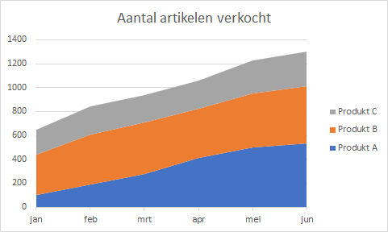

# Vlakdiagram {#charttype_area}

Gebruik dit grafiektype om het verloop van meerdere gegevensreeksen in de tijd weer te geven waarbij ook het totaal van de waarden zichtbaar moet worden.

Tevens wordt dan de verhouding van een gedeelte tot het totaal zichtbaar.

Vlakdiagrammen zijn gebaseerd op lijndiagrammen. Het vlak tussen de as en de lijn wordt vaak gemarkeerd met kleuren of arceringen. Net als bij een lijndiagram wordt de grootte van een variabele over een bepaalde tijdsperiode weergegeven. In een gestapeld vlakdiagram zijn meerdere gegevensreeksen boven elkaar geplaatst, zodat tevens de som van de gegevens is af te lezen. Ook de verhouding van een deel tot het geheel kun je goed zien.

In de volgende afbeelding zie je de verkochte aantallen van drie produkten van een bedrijf gedurende het eerste halfjaar. De totalen per maand zijn ook goed af te lezen.

  

