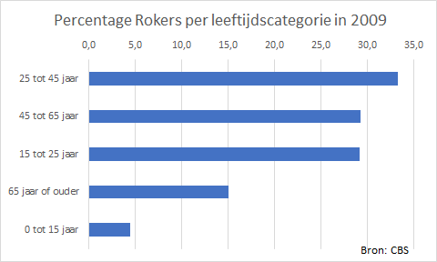

# Staafdiagram {#charttype_bar}

Gebruik dit grafiektype voor de onderlinge vergelijking van gegevens en hun rangordes.

In staafdiagrammen worden de categorieën geplaatst langs de verticale as en de waarden langs de horizontale as. Voor elke categorie wordt er een staaf geplaatst waarbij de lengte van de staaf overeenkomt met de waarde.

Staafdiagrammen worden veel gebruikt om verschillen in rangorde duidelijk te maken. De waarden worden vaak gesorteerd van hoog naar laag, zodat het hoogste resultaat als eerste staaf wordt weergegeven. Het onderlinge verschil in belang \(de prioriteit\) van bepaalde zaken op eenzelfde moment wordt zo tot uitdrukking gebracht.

De volgende afbeelding toont het percentage rokers per leeftijdscategorie in 2009.

 

