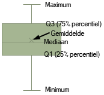
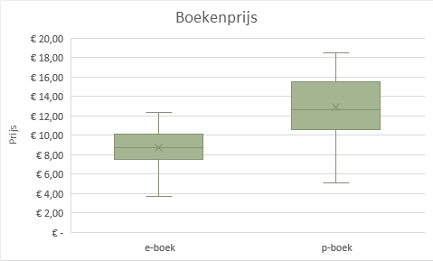

# Boxplot {#charttype_boxwhisker}

Dit grafiektype kun je gebruiken om belangrijke statistische kenmerken van gegevensverdelingen te markeren.

Een boxplot wordt in de statistiek veel gebruikt en is een diagram waarin de karakteristieke getallen van een verdeling worden weergegeven, zoals gemiddelde, mediaan, kwartielen en uitschieters. Daarbij zijn boxplots ook erg nuttig om de karakteristieken van verschillende datasets met elkaar te vergelijken.

  

Een boxplot verdeelt de gegevensverzameling in vier gebieden:

-   Minimum - Q1
-   Q1 - Mediaan
-   Mediaan - Q3
-   Q3 - Maximum

Het gemiddelde wordt aangegeven met de markering “X”.

In de volgende afbeelding worden de prijzen van e-boeken via boxplots vergeleken met die van papieren boeken \(p-boeken\).

  

