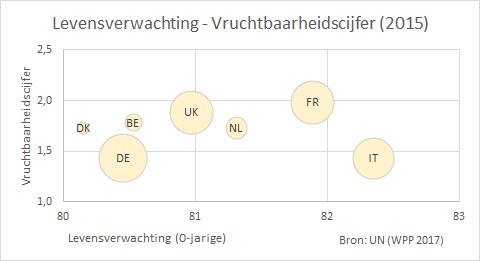

# Bellendiagram {#charttype_bubble}

Dit grafiektype kun je gebruiken wanneer je de relatie tussen drie numerieke variabelen weer wilt geven.

Een bellendiagram is een uitbreiding op een spreidingsdiagram. Bij de laatste worden twee numerieke variabelen \(X en Y\) tegen elkaar uitgezet. Bij een bellendiagram wordt nog een derde variabele \(Z\) gebruikt. De plaats van de bel \(cirkel\) in het diagram wordt bepaald doorr de X- en Y-variabele. En de grootte van de bel door de Z-variabele.

In de volgende afbeelding is voor een zevental Europese landen voor het jaar 2015 de levensverwachting van een pasgeborene tegen het het aantal geboren kinderen per vrouw \(vruchtbaarheidscijfer\). Voor de grootte van de bel is de bevolkingsomvang voor dat land in 2015 genomen.

 

