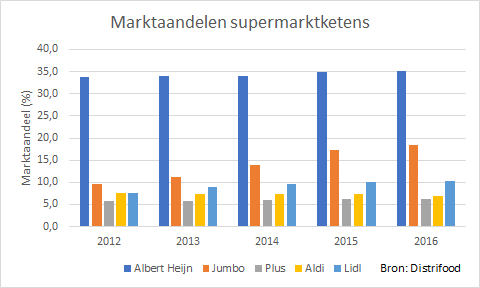

# Kolomdiagram {#charttype_column}

Gebruik dit grafiektype om veranderingen van gegevens in de loop van de tijd weer te geven.

In kolomdiagrammen worden de categorieën geplaatst langs de horizontale as \(categorieas\) en de waarden langs de verticale as \(waardeas\). Voor elke categorie wordt er een kolom geplaatst waarbij de hoogte van de kolom overeenkomt met de waarde.

Kolomdiagrammen worden vooral gebruikt wanneer tijdseenheden als jaren, kwartalen, maanden, weken en dagen een rol spelen. Gebruik niet teveel categorieën. Vijf tot zes waarden zijn nog goed te overzien. Wanneer meer dan 6 waarden op de categorie-as uitgezet moeten worden kun je beter voor een lijndiagram kiezen.

De volgende afbeelding toont de marktaandelen van een aantal supermarktketens voor de jaren 2012-2016 in Nederland .

  

