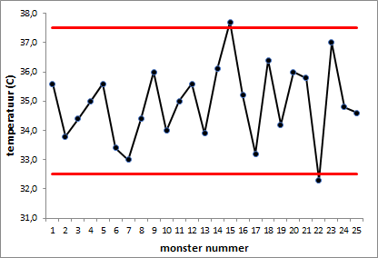

# Regeldiagram {#charttype_control}

Dit grafiektype kun je gebruiken bij het controleren of meetwaarden buiten de toegestane grenzen komen.

In een regeldiagram wordt het verloop in de tijd van een meetwaarde geregistreerd. Verder worden tevens de grenzen aangegeven waarbinnen de meetwaarde mag varieren. Regeldiagrammen worden veel gebruikt bij de Statistische Proces Controle \(SPC\) om vast te stellen of een productieproces of bedrijfsproces nog goed functioneert. Wanneer de meetwaarde buiten de toegestane grenzen komt moet er worden ingegrepen en het proces worden bijgesteld.

In de volgende afbeelding zijn de temperatuurmetingen van 25 monsters te zien. De twee horizontale lijnen geven de bovengrens en de ondergrens aan. Duidelijk is te zien dat twee keer de temperatuur buiten het toegestane gebied is gekomen.

 

Een regeldiagram is in feite een lijndiagram met twee extra horizontale lijnen.

