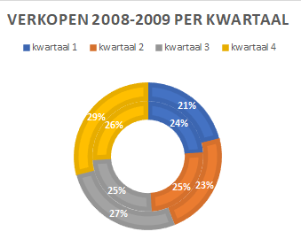

# Ringdiagram {#charttype_doughnut}

Gebruik dit grafiektype om de procentuele verdeling binnen meerdere gegevensgroepen weer te geven.

Een ringdiagram, ook wel doughnut diagram genoemd, is een uitbreiding van het cirkeldiagram. Dit diagram kan één of meerdere ringen bevatten en elke ring vertegenwoordigt een gegevensreeks.

Ringdiagrammen zijn niet altijd gemakkelijk te lezen, een gestapeld kolom- of staafdiagram is dan een goed alternatief.

In de volgende afbeelding zijn de verkopen per kwartaal van een bedrijf in de jaren 2008 en 2009 te zien.

 

