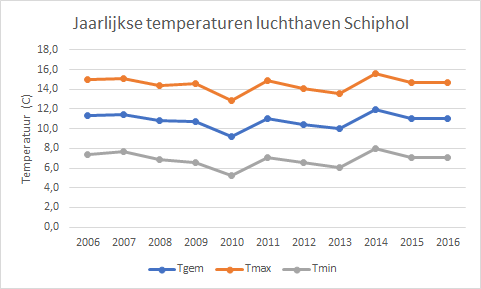

# Lijndiagram {#charttype_line}

Gebruik dit grafiektype voor het weergeven van tijdreeksen.

Bij lijndiagrammen wordt de tijdeenheid langs de horizontale as \(categorieas\) uitgezet en de gemeten variabele langs de verticale as. Tussen de punten in de grafiek kan desgewenst een lijn getrokken worden om het verloop van de variabele in de tijd goed zichtbaar te maken.

Lijndiagrammen zijn goed voor het weergeven van het verloop van een gemeten waarde met een continu verloop over een bepaald tijdsinterval zichtbaar te maken. Trends en seizoensinvloeden worden zo goed zichtbaar.

In een lijndiagram kunnen meerdere lijnen geplaatst worden. Beperk het aantal omwille van de leesbaarheid tot maximaal 4 à 5 lijnen. Kies ook passende schalen, want hoe het verloop van de lijn hangt eruit ziet hangt vaak sterk af van de gekozen schaal.

**Waarschuwing:** 

Let er op dat bij een lijndiagram de horizontale as nooit metrisch is. Dat is geen bezwaar wanneer je van elke periode gegevens hebt, maar je moet er mee oppassen wanneer voor sommige periodes de gegevens ontbreken. Vaak is dan een spreidingsdiagram een betere keuze.

De volgende afbeelding toont de jaarlijkse temperaturen \(gemiddelde, maximum en minimum\) voor de luchthaven Schiphol.

  

