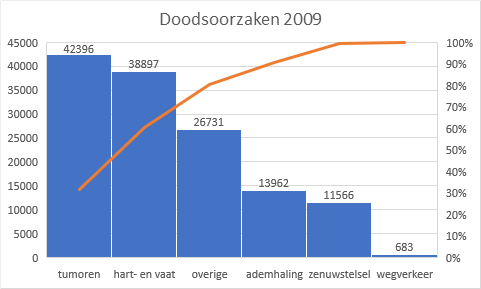

# Paretodiagram {#charttype_pareto}

Dit grafiektype kun je gebruiken bij het uitvoeren van een Pareto analyse.

Een Paretodiagram is een combinatie van een kolomdiagram en een lijndiagram. Bij het kolomdiagram zijn de kolommen van groot naar klein gesorteerd. Het lijndiagram ligt bovenop de kolommen en geeft het cumulatieve totaal weer. Het kolomdiagram gebruikt de normale Y-as aan de linkerkant. Voor het lijndiagram is er aan de rechterkant een tweede Y-as met waarden van 0% tot 100%.

Een Paretodiagram is een veel gebruikt hulpmiddel bij een Pareto analyse. Hierbij probeert men de meest belangrijke factoren op te sporen, zoals de meest voorkomende oorzaken, defecten, klachten, storingen, klanten, producten, ...

In de volgende afbeelding zijn de doodsoorzaken in Nederland in het jaar 2009 te zien. De kolomdiagram geeft aan dat 42396 keer tumoren de oorzaak waren. En de oranje Paretolijn laat zien dat dit ongeveer 30% van het totaal is. En dat tumoren en hart- en vaatziekten samen 60% van het totaal aantal doodsoorzaken vormt.

  

