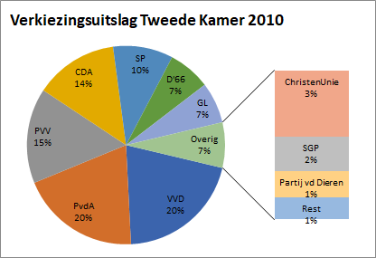

# Cirkeldiagram {#charttype_pie}

Gebruik dit grafiektype om de procentuele verdeling binnen één gegevensgroep weer te geven.

Cirkeldiagrammen worden vooral gebruikt voor het weergeven van de procentuele verdeling van gegevens binnen één groep, zoals bijvoorbeeld verkiezingsresultaten. Teveel aan informatie kan een cirkeldiagram onoverzichtelijk maken. Om het overzichtelijk te houden moet je hooguit 6 à 7 sectoren in een cirkeldiagram gebruiken.Bij meer sectoren kan beter voor een combinatiediagram gekozen worden.

Bij een cirkeldiagram is de cirkel opgedeeld in een aantal sectoren \(taartpunten\). De grootte van elke sector geeft het deel van het geheel weer. De gehele cirkel is steeds 100%.

In de volgende afbeelding is de uitslag van de 2e Kamerverkiezing 2010 met een cirkeldiagram weergegeven. Hieraan hebben 19 partijen deelgenomen. In het diagram zijn alleen die partijen weergegeven die meer dan 5% hebben behaald, dat zijn er zeven. Alle overige partijen zijn samengevat onder de naam Overig.

 

Om ook de onderverdeling in de categorie Overig zichtbaar te maken kan deze bijvoorbeeld uitgesplitst worden in een staafdiagram. In de volgende afbeelding zijn de resultaten voor de partijen uit de categorie Overig die 1% of meer behaald hebben weergegeven in een staafdiagram. De partijen die minder dan 1% behaald hebben zijn weer samengevat in de categorie Rest.

 

