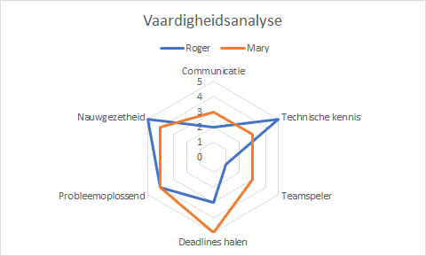

# Radardiagram {#charttype_radar}

Een radardigram kun je gebruiken wanneer je meerdere categorieën langs afzonderlijke assen wilt uitzetten.

In een radardiagram worden meerdere gegevensreeksen \(categorieën\) uitgezet langs afzonderlijke assen die steeds vanuit een punt in het midden, de oorsprong, vertrekken. Het diagram ziet er daardoor webvormig uit en wordt daarom ook wel spindiagram of sterdiagram genoemd. De hoeken tussen deze assen zijn gelijk. De gegevenspunten op de assen worden meestal met een lijn verbonden.

Een radardiagram kan gebruikt worden om vragen te beantwoorden als: Welke categorie is dominant? Welke categorieën zijn het meest vergelijkbaar? Zijn er uitschieters? Radar diagrammen worden ook vaak gebruikt om verschillende aspecten van een bepaald onderwerp te onderzoeken en gevisualiseerd weer te geven.

In de volgende afbeelding worden de beoordelingen op een 5-punts Likert schaal van een vaardigheidsanalyse van Roger en Mary met elkaar vergeleken.

 

