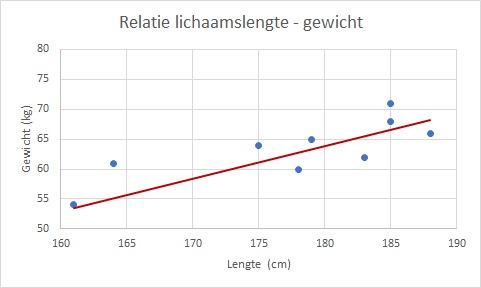

# Spreidingsdiagram {#charttype_scatter}

Gebruik dit grafiektype wanneer je het verband tussen twee numerieke variabelen wilt weergeven.

Bij een spreidingsdiagram, ook wel XY diagram of scatterdiagram genoemd, worden de waarden van twee numerieke variabelen tegen elkaar uitgezet. Elk paar getallen levert een punt in het diagram op. Een spreidingsdiagram wordt vaak gebruikt om te onderzoeken of er een bepaald verband, een correlatie, tussen de twee variabelen is.

In de volgende afbeelding zijn de lichaamslengte en het gewicht van 10 studenten tegen elkaar uitgezet. Tevens is een lineaire trendlijn getekend.

  

