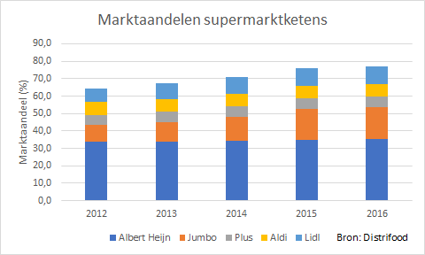
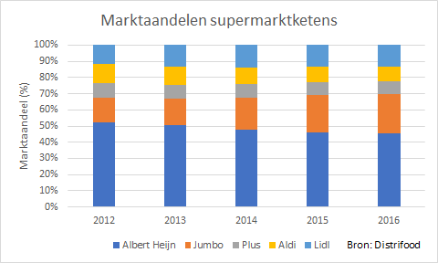

# Gestapeld kolom- en staafdiagram {#charttype_stacked}

Gebruik dit grafiektype om bij meerdere gegevensgroepen de onderlinge verdeling en het totaal van de waarden weer te geven.

Bij meerdere gegevensreeksen kun je de kolommen en staven naast elkaar zetten, maar je kunt er ook voor kiezen om ze boven op elkaar te zetten. Dit wordt een gestapeld kolomdiagram of gestapeld staafdiagram genoemd. Dit is vooral handig wanneer de onderlinge verdeling de waarden en het totaal hiervan gevisualiseerd moet worden.

Marktaandelen van een aantal supermarktketens voor de jaren 2012-2016 in Nederland. Zowel de onderlinge verdeling als de wijziging in de jaren is te zien. Daarnaast is ook het verloop van het van de marktaandelen van deze 5 ketens samen zichtbaar, dit is immers de totale hoogte van de kolom.

 

Een variant hierop is wanneer de totale lengte van de staaf steeds 100% is en dus steeds even lang is. In dit soort diagrammen worden de onderlinge verhoudingen nog beter zichtbaar.

  

