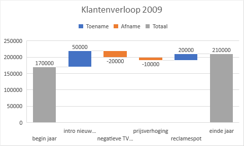

# Watervaldiagram {#charttype_waterfall}

Dit grafiektype kun je gebruiken om een beeld te schetsen van positieve en negatieve wijzigingen in een waarde over een bepaalde periode.

In een watervaldiagram worden de begin- en eindwaarden weergegeven als kolommen. De afzonderlijke negatieve en positieve aanpassingen worden weergegeven als zwevende stappen. Het belangrijkste kenmerk van een watervaldiagram is dat deze niet alleen veranderingen in de loop van de tijd weergeeft, maar ook in relatie tot de vorige periode of andere meetwaarde. Elke stap in de waterval brengt je naar het eindresultaat en laat zien hoe je daar bent gekomen.

In de volgende afbeelding is de wijziging in het aantal klanten bij een telecombedrijf te zien, alsmede de invloed hierop van een aantal gebeurtenissen. De grijs gekleurde kolommen geven de begin- en eindsituatie aan, de blauw gekleurde kolommen staan voor een toename en de oranje gekleurde kolommen voor een afname van het aantal klanten.

  

